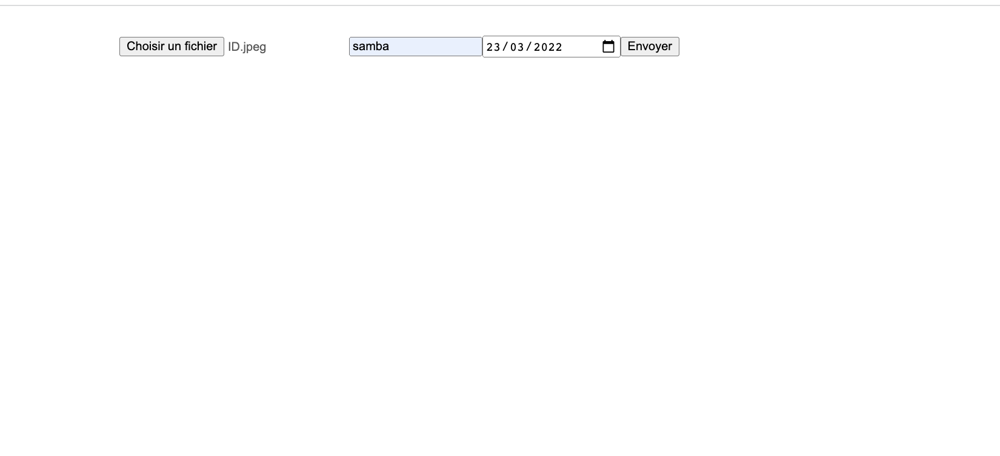

# Uploading files in Node with Multer
https://github.com/expressjs/multer

# Screen

Uploading gile  App Using The MERN Stack 🤩

 

https://github.com/expressjs/multer

#  Installation

npm install --save multer

# Usage

Multer adds a body object and a file or files object to the request object. 
The body object contains the values of the text fields of the form, the file or files object contains the files uploaded via the form.

Basic usage example:

Don't forget the enctype="multipart/form-data" in your form.

<form action="/profile" method="post" enctype="multipart/form-data">
  <input type="file" name="avatar" />
</form>

const express = require('express')
const multer  = require('multer')
const upload = multer({ dest: 'uploads/' })

const app = express()

app.post('/profile', upload.single('avatar'), function (req, res, next) {
  // req.file is the `avatar` file
  // req.body will hold the text fields, if there were any
})

app.post('/photos/upload', upload.array('photos', 12), function (req, res, next) {
  // req.files is array of `photos` files
  // req.body will contain the text fields, if there were any
})

const cpUpload = upload.fields([{ name: 'avatar', maxCount: 1 }, { name: 'gallery', maxCount: 8 }])
app.post('/cool-profile', cpUpload, function (req, res, next) {
  // req.files is an object (String -> Array) where fieldname is the key, and the value is array of files
  //
  // e.g.
  //  req.files['avatar'][0] -> File
  //  req.files['gallery'] -> Array
  //
  // req.body will contain the text fields, if there were any
})

In case you need to handle a text-only multipart form, you should use the .none() method:

const express = require('express')
const app = express()
const multer  = require('multer')
const upload = multer()

app.post('/profile', upload.none(), function (req, res, next) {
  // req.body contains the text fields
})
Here's an example on how multer is used an HTML form. Take special note of the enctype="multipart/form-data" and name="uploaded_file" fields:

<form action="/stats" enctype="multipart/form-data" method="post">
  

    <input type="file" class="form-control-file" name="uploaded_file">
    <input type="text" class="form-control" placeholder="Number of speakers" name="nspeakers">
    <input type="submit" value="Get me the stats!" class="btn btn-default">
  

</form>
Then in your javascript file you would add these lines to access both the file and the body. It is important that you use the name field value from the form in your upload function. This tells multer which field on the request it should look for the files in. If these fields aren't the same in the HTML form and on your server, your upload will fail:

const multer  = require('multer')
const upload = multer({ dest: './public/data/uploads/' })
app.post('/stats', upload.single('uploaded_file'), function (req, res) {
   // req.file is the name of your file in the form above, here 'uploaded_file'
   // req.body will hold the text fields, if there were any 
   console.log(req.file, req.body)
});
